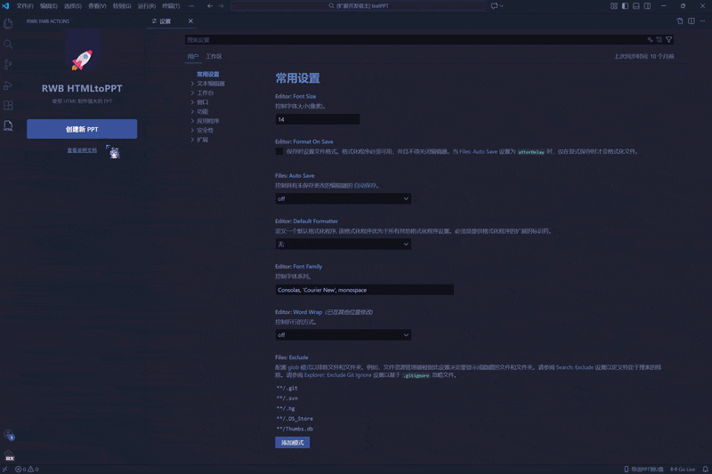
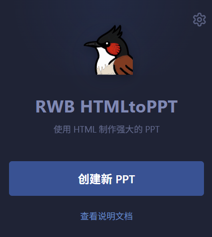
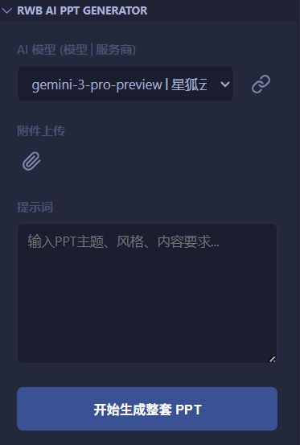
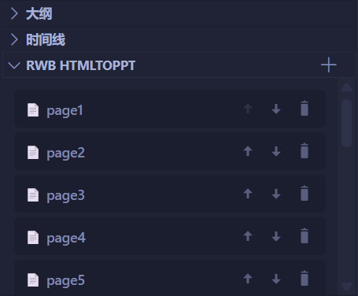
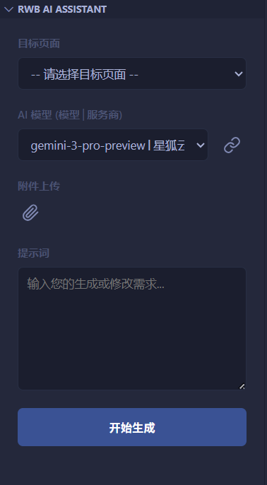
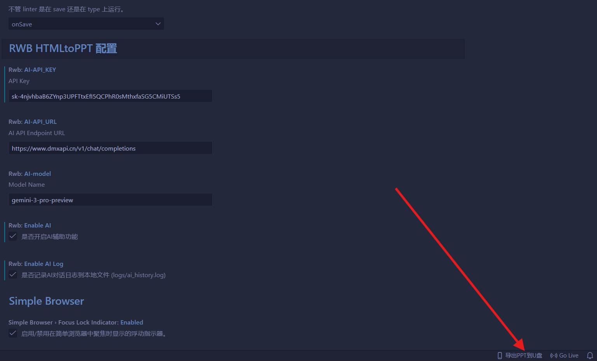
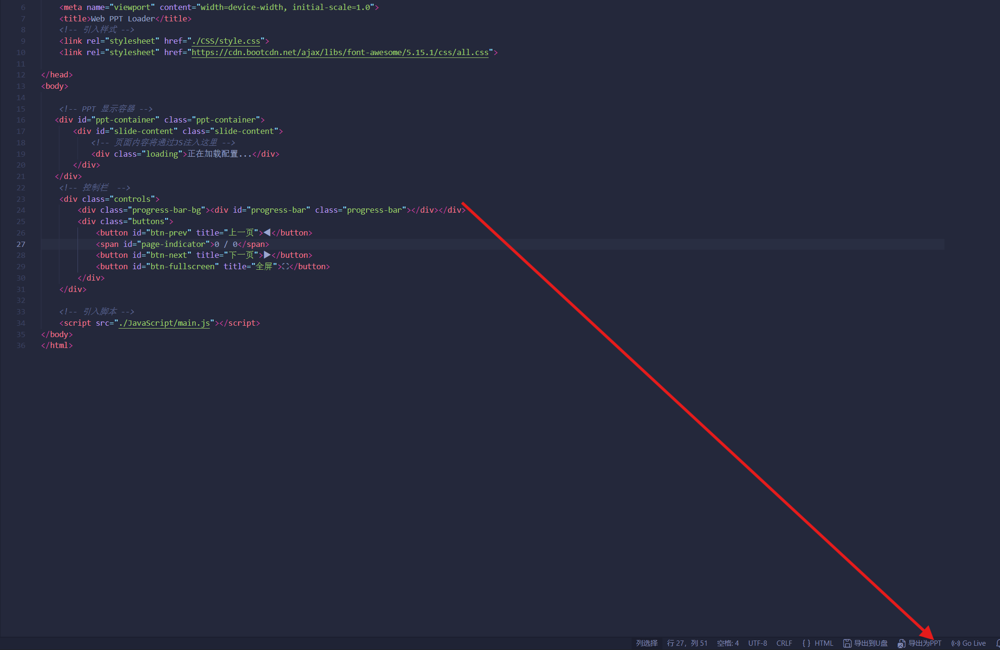
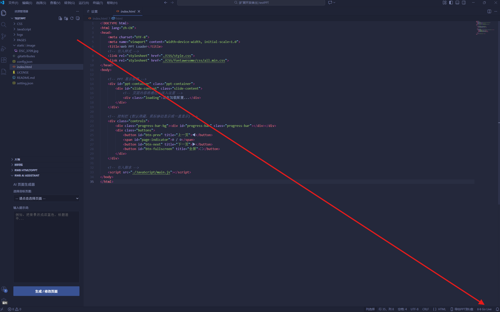

# RWB HTMLtoPPT

**RWB HTMLtoPPT** 是一款功能强大的 VS Code 扩展，专为将 HTML/CSS 技术转化为精美演示文稿（PPT）而设计。

它不仅是一个项目脚手架，更是一个集成了 **AI 全自动生成**、**可视化页面管理**、**智能代码辅助** 以及 **多格式导出** 的完整生产力工具。生成的项目基于轻量级 Web 演示框架，支持酷炫的 CSS 动画、全屏演示和便携式部署。


<!-- 插件整体功能演示 -->

---
# 如何获取？
## 直接在VScode拓展中搜索 “RWB HTMLtoPPT"
## 在微软插件市场搜索“RWB HTMLtoPPT" :https://marketplace.visualstudio.com/
## 直接下载release然后到VScode安装

# 🛠️ 第一部分：VS Code 插件功能指南

## ✨ 核心功能 (Core Features)

### 1. 🚀 快速创建项目 (Project Initialization)
通过侧边栏的 **RWB Actions** 面板，您可以一键初始化标准的 HTML PPT 项目。
*   **智能模板缓存**：插件会自动拉取最新的 Git 模板并缓存到本地，确保您总是使用最新的框架版本。
*   **环境自动配置**：自动处理目录结构，开箱即用。



### 2. 🤖 AI 全自动生成 PPT (AI PPT Generator) <span style="color:red;font-size:0.8em">NEW!</span>
无需手动编写，让 AI 为您从零构建整套演示文稿！
*   **大纲先行**：输入主题（如“2024年终总结”），AI 会先规划详细的 PPT 大纲（封面、目录、内容页等）。
*   **批量并发生成**：确认大纲后，系统会自动创建文件，并并发请求 AI 生成每一页的 HTML/CSS 代码。
*   **可视化进度**：提供清晰的步骤条，实时显示大纲生成及每一页的构建状态（Loading/Done/Error）。
*   **参考素材投喂**：支持上传本地文件（文档/图片）作为 AI 生成内容的参考资料。


<!-- 请在此处截图：AIPPTGenerator 的 Webview 界面，显示进度条或输入框 -->

### 3. 📄 可视化页面管理 (Page Management)
在 **RWB HTMLtoPPT** 资源管理器视图中，像操作 PowerPoint 幻灯片缩略图一样管理 HTML 文件：
*   **➕ 插入页面**（新功能）：点击页面卡片上的插入按钮，支持在当前页之后插入新页，插件会**自动重命名后续所有文件**（如在 page2 后插入，原 page3 自动变为 page4...），保持顺序连贯。
*   **🔃 重置模板**：页面写乱了？一键将当前页重置为默认的初始布局。
*   **排序与删除**：支持上移、下移和删除页面，所有文件名索引自动维护，无需手动改名。


<!-- 截图建议：展示带有插入和重置按钮的新版页面列表 -->

### 4. 🧠 智能 AI 代码助手 (AI Assistant)
针对单页内容的精细化修改，内置了强大的上下文感知 AI。
*   **多模态支持**：支持上传图片（参考设计图）或文档，让 AI 根据素材编写代码。
*   **多任务处理**：
    *   **后台运行**：点击“后台进行”，你可以继续在 VS Code 中写代码，AI 会在后台默默完成任务。
    *   **任务列表**：底部实时显示任务队列状态。
*   **精准控制**：支持随时“停止生成”。



### 5. 💾 双模式导出 (Export Options)

#### 🅰️ 导出为 U 盘便携版 (Portable Web)
一键打包项目到 U 盘，生成无需安装环境的独立运行包。
*   **自动部署 Nginx**：插件会自动解压内置的 Nginx 服务器到 U 盘。
*   **一键启动/关闭**：
    *   生成 `启动RWB-PPT环境.bat`：双击即可开启本地服务器演示。
    *   生成 `关闭RWB-PPT.bat`（新功能）：演示结束后，双击此脚本可彻底关闭 Nginx 和浏览器进程，安全拔出 U 盘。



#### 🅱️ 导出为 PPTX 文件 (Export to PPT) <span style="color:red;font-size:0.8em">NEW!</span>
需要发送给客户？支持将 HTML 页面渲染并导出为标准的 `.pptx` 文件。
*   **原理**：利用高清渲染技术将每一页 HTML 转换为幻灯片图片。
*   **智能资源处理**：自动处理本地图片资源，解决跨域问题，确保导出的 PPT 内容完整。
*   点击状态栏右下角的 `$(file-media) 导出为PPT` 按钮即可使用。


<!-- 请在此处截图：导出 PPT 过程中的 Webview 渲染界面或状态栏按钮 -->

---

## ⚙️ 扩展设置 (Extension Settings)

本插件支持高度自定义的 AI 模型配置，请在 VS Code 设置中搜索 `rwb`：

| 设置项 (ID) | 类型 | 说明 |
| :--- | :--- | :--- |
| `rwb.aiProviders` | Array | **AI 服务商配置核心**。支持配置多个服务商（OpenAI/DeepSeek/Gemini等），每个服务商下可配置多个 API Key 和模型名称。插件界面提供下拉菜单灵活切换。 |
| `rwb.pptBatchSize` | Number | **批量生成并发数**。默认为 3。AI 生成整套 PPT 时，每次并发生成的页数。数值越大速度越快，但可能触发 API 速率限制。 |
| `rwb.AI-temperature` | Number | **创造力 (0-2)**。值越高 AI 越有创意，值越低生成的代码越稳定。 |
| `rwb.enableAILog` | Boolean | 是否在 `logs/ai_history.log` 中记录详细的 AI 对话日志。 |


<!-- 请在此处截图：VS Code 设置页面中 rwb.aiProviders 的配置界面 -->

---

# 🚀 快速开始 (Quick Start)

1.  **安装插件**：在 VS Code 插件市场搜索 `RWB HTMLtoPPT` 并安装。
2.  **配置 AI**：在设置中配置您的 API Key 和模型地址（支持 OpenAI 格式接口）。
3.  **创建项目**：
    *   点击侧边栏 RWB 图标 -> "RWB Actions" -> 输入项目名并创建。
4.  **生成内容**：
    *   **方式 A (全自动)**：打开 "RWB AI PPT Generator" 面板，输入主题（如“公司季度财报”），点击生成，等待 AI 完成所有页面。
    *   **方式 B (手动/半自动)**：在 "RWB HTMLtoPPT" 面板添加页面，使用 "AI Assistant" 对单页进行修饰（如“把背景改成科技感深蓝色”）。
5.  **预览与演示**：
    *   右键 `index.html` 选择 "Open with Live Server" 进行实时预览。
    *   按 `F11` 全屏即可开始演讲。

---

# 📖 第二部分：生成的 PPT 项目开发指南

## 📁 项目目录结构

```text
PPT/
├── index.html          # [入口] 核心控制文件（包含页面加载器）
├── setting.json        # [配置] 全局配置（定义页面顺序、比例、标题）
├── ppt_outline.json    # [数据] AI 自动生成的大纲数据备份
├── PAGES/              # [内容] 存放每一页的 HTML 文件
│   ├── page1.html
│   ├── page2.html
│   └── ...
├── CSS/                # [样式]
│   └── style.css       # 全局样式表
├── static/             # [资源]
│   ├── image/          # 图片资源
│   └── ...
└── ...
```
## ⚠️ 运行注意事项 (必读)

由于浏览器安全策略（CORS 跨域限制），**不能直接双击 `index.html` 打开**，否则会导致无法读取 JSON 配置和 HTML 页面文件。

**推荐启动方式：**
1. 在 VS Code 中，右键点击 `index.html` 文件。
2. 选择 **"Open with Live Server"**。
3. 浏览器将自动弹出并显示 PPT。



## 📝 制作指南

### 1. 全局配置 (`setting.json`)
管理页面播放顺序和基础设置：

```json
{
  "projectTitle": "演示文稿标题",   // 浏览器标签页标题
  "aspectRatio": "16:9",         // PPT 比例，支持 "16:9", "4:3" 等
  "clickToFlip": true,           // 是否启用点击屏幕空白处翻页
  "pages": [                     // 【重要】页面播放顺序列表
    "page1.html",
    "page2.html"
  ]
}
```
> **提示**：使用插件侧边栏的“页面管理”功能可以自动更新此文件。

### 2. 编写页面内容
1. 在 `PAGES` 文件夹中新建 HTML 文件。
2. **不需要**写 `<html>`, `<head>`, `<body>`，直接写内容。
3. **引用资源**：路径需相对于根目录 `index.html`（例如 `./static/image/a.jpg`）。

**示例代码：**
```html
<div class="my-slide">
  <h1>标题内容</h1>
  
</div>
```

### 3. 使用内置动画
系统在 `CSS/style.css` 中预置了动画类，直接添加到 HTML 标签上即可生效：

* **动画类型**：
 * `anim-up`: 元素从下方浮现。
 * `anim-left`: 元素从左侧滑入。
 * `fade-in`: 简单的淡入。
* **动画延时**（用于控制元素出现的先后顺序）：
 * `delay-1`: 延迟 0.2秒
 * `delay-2`: 延迟 0.5秒
 * `delay-3`: 延迟 0.8秒

**示例：**
```html
<h2 class="anim-up">目录</h2>
<ul>
  <li class="anim-up delay-1">第一章</li>
  <li class="anim-up delay-2">第二章</li>
</ul>
```

## 🎮 演示快捷键

系统支持多种交互方式，方便在演讲时控制进度：

| 按键 / 操作 | 功能 |
| :--- | :--- |
| **鼠标滚轮向下** | **下一页** |
| **鼠标滚轮向上** | **上一页** |
| **→** (右箭头) | 下一页 |
| **Space** (空格) | 下一页 |
| **Enter** (回车) | 下一页 |
| **←** (左箭头) | 上一页 |
| **F** 键 | 开启/退出全屏模式 |
| **鼠标左键点击** | 下一页 (需在配置中开启 `clickToFlip`) |

## ❓ 常见问题 (FAQ)

**Q: 打开显示 "Loading..." 或一片空白？**
A: 请检查是否直接双击打开了 `index.html`。必须使用 "Live Server" 或本地服务器运行。如果是 U 盘版，请确保先运行了 `nginx.exe`。

**Q: 图片显示不出来？**
A: 请检查图片路径。路径应该是相对于根目录的，例如 `./static/image/photo.png`，而不是相对于 PAGES 文件夹的 `../static`。

**Q: 如何修改配色？**
A: 打开 `CSS/style.css`，修改 `:root` 下的变量（如 `--bg-color`, `--text-color`）即可全局换色。

---

