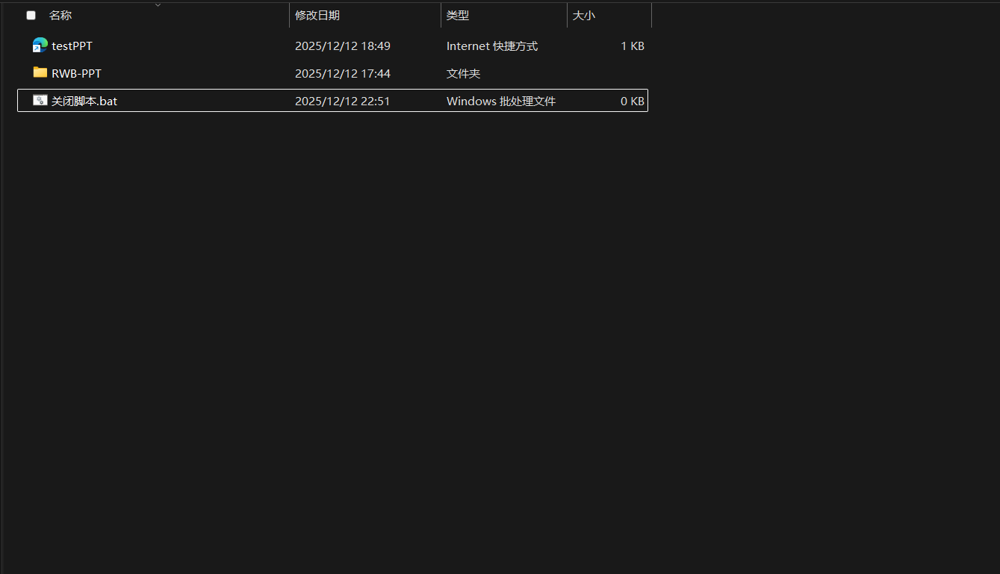

# RWB HTMLtoPPT

**RWB HTMLtoPPT** 是一个强大的 VS Code 扩展，旨在帮助用户利用 HTML/CSS 技术快速构建演示文稿（PPT）。它不仅集成了项目脚手架、可视化的页面管理、AI 代码生成辅助，还包含了一键导出 U 盘便携版的功能。

生成的项目基于轻量级 Web 演示框架，支持动画、全屏、鼠标滚轮控制和进度管理，让你可以像写网页一样写 PPT。


<!-- 请在此处放置一张插件的整体预览图或 GIF -->

---

# 🛠️ 第一部分：VS Code 插件指南

## ✨ 主要功能 (Extension Features)

### 1. 快速创建项目 (Project Initialization)
通过侧边栏的 **RWB Actions** 面板，你可以快速创建一个基于标准模板的 HTML PPT 项目。插件会自动处理 Git 模板拉取和本地环境初始化。


### 2. 可视化页面管理 (Page Management)
在 **RWB HTMLtoPPT** 资源管理器视图中，你可以像操作 PPT 幻灯片一样管理 HTML 页面：
* **添加页面**：点击标题栏的 `+` 号自动生成新页面。
* **调整顺序**：通过上移/下移按钮调整页面播放顺序（自动重命名文件并更新配置）。
* **删除页面**：一键删除页面并自动维护文件名连续性。


### 3. AI 智能辅助 (AI Assistant)
内置 **RWB AI Assistant**，让非前端专业人士也能轻松修改样式。
* **自然语言指令**：输入 "把背景改成深蓝色" 或 "标题居中"，AI 自动修改代码。
* **上下文感知**：自动读取当前选中的 HTML 文件内容进行修改。
* **配置灵活**：支持自定义 API Endpoint 和模型。


### 4. 便携式 U 盘导出 (Portable Export)
一键将项目打包导出到 U 盘或移动硬盘，生成独立运行环境，无需在演示电脑上安装 Node.js 或 VS Code。

**💾 导出及使用步骤：**
1. **导出**：插入 U 盘，点击 VS Code 状态栏右下角的 `$(device-mobile) 导出PPT到U盘` 按钮，选择 U 盘根目录。插件会自动解压 Nginx 服务器环境并生成启动脚本。
2. **启动服务器**：
 * 打开 U 盘中导出的项目文件夹（包含 `nginx.exe` 的目录）。
 * 双击运行 **`nginx.exe`**。
 * *注意：此时可能会有一个黑色命令行窗口一闪而过，这是正常的，代表后台服务器已成功启动。*
3. **开始演示**：
 * 回到 U 盘根目录（或刚刚那个文件夹的上级目录）。
 * 找到并双击自动生成的 **快捷方式**（通常命名为 `Click_To_Start.url` 或类似名称）。
 * 演示文稿将在默认浏览器中打开，即可开始演讲。



---

## ⚙️ 扩展设置 (Extension Settings)

本插件提供了详细的 AI 配置选项，请在 VS Code 设置中搜索 `rwb` 进行配置：

| 设置项 (ID) | 类型 | 默认值 | 说明 |
| :--- | :--- | :--- | :--- |
| `rwb.enableAI` | boolean | `false` | 是否开启 AI 辅助功能视图 (需要重启 VS Code 生效) |
| `rwb.AI-API_URL` | string | `https://www.dmxapi.cn/v1/chat/completions` | AI 服务的 API 接口地址 (OpenAI 兼容格式) |
| `rwb.AI-API_KEY` | string | `""` | AI 服务的 API Key |
| `rwb.AI-model` | string | `gemini-3-pro-preview` | 使用的模型名称 |
| `rwb.enableAILog` | boolean | `false` | 是否在项目 `logs/ai_history.log` 中记录 AI 对话日志 |

## 🚀 插件快速开始 (Quick Start)

1. **安装插件**：在 VS Code 插件市场搜索安装。
2. **创建项目**：
 * 点击侧边栏 RWB 图标。
 * 在 "RWB Actions" 中输入项目名，选择路径，点击创建。
3. **编辑页面**：
 * 在 "RWB HTMLtoPPT" 面板中点击 `+` 添加新页面。
 * **预览**：右键点击 `index.html` 选择 "Open with Live Server" (插件会自动提示安装)。
4. **使用 AI (可选)**：
 * 在设置中开启 `rwb.enableAI` 并填入 API Key。
 * 在 "RWB AI Assistant" 面板选择页面，输入修改指令。

## 📦 依赖与已知问题

* **依赖**：本插件推荐安装 [Live Server](https://marketplace.visualstudio.com/items?itemName=ritwickdey.LiveServer) 以实现实时预览。
* **已知问题**：
 * 导出功能目前仅支持 Windows 环境（依赖 `nginx.exe` 和 `.bat` 脚本）。
 * AI 功能依赖网络连接，请确保 API 地址可访问。

---

# 📖 第二部分：生成的 PPT 项目开发指南

当你使用本插件创建一个新项目后，你将得到一个完整的 Web PPT 演示系统。以下是如何编写和配置具体内容的指南。

## 📁 项目目录结构

```text
PPT/
├── index.html          # [核心] PPT 入口文件（无需修改，请勿直接双击打开）
├── setting.json        # [核心] 全局配置文件（页面列表、比例、标题）
├── config.json         # [扩展] API 及后端配置（预留）
├── PAGES/              # [内容] 存放每一页的 HTML 内容文件
│   ├── page1.html
│   └── ...
├── CSS/                # [样式]
│   └── style.css       # 核心样式表
├── JavaScript/         # [脚本]
│   └── main.js         # 核心逻辑脚本
├── static/             # [资源] 存放静态文件
│   ├── image/          # 图片
│   ├── video/          # 视频
│   └── icon/           # 图标
└── ...
```

## ⚠️ 运行注意事项 (必读)

由于浏览器安全策略（CORS 跨域限制），**不能直接双击 `index.html` 打开**，否则会导致无法读取 JSON 配置和 HTML 页面文件。

**推荐启动方式：**
1. 在 VS Code 中，右键点击 `index.html` 文件。
2. 选择 **"Open with Live Server"**。
3. 浏览器将自动弹出并显示 PPT。


*(备选方案：使用 Python `python -m http.server` 或 Node.js `http-server` 启动本地服务)*

## 📝 制作指南

### 1. 全局配置 (`setting.json`)
管理页面播放顺序和基础设置：

```json
{
  "projectTitle": "演示文稿标题",   // 浏览器标签页标题
  "aspectRatio": "16:9",         // PPT 比例，支持 "16:9", "4:3" 等
  "clickToFlip": true,           // 是否启用点击屏幕空白处翻页
  "pages": [                     // 【重要】页面播放顺序列表
    "page1.html",
    "page2.html"
  ]
}
```
> **提示**：使用插件侧边栏的“页面管理”功能可以自动更新此文件。

### 2. 编写页面内容
1. 在 `PAGES` 文件夹中新建 HTML 文件。
2. **不需要**写 `<html>`, `<head>`, `<body>`，直接写内容。
3. **引用资源**：路径需相对于根目录 `index.html`（例如 `./static/image/a.jpg`）。

**示例代码：**
```html
<div class="my-slide">
  <h1>标题内容</h1>
  
</div>
```

### 3. 使用内置动画
系统在 `CSS/style.css` 中预置了动画类，直接添加到 HTML 标签上即可生效：

* **动画类型**：
 * `anim-up`: 元素从下方浮现。
 * `anim-left`: 元素从左侧滑入。
 * `fade-in`: 简单的淡入。
* **动画延时**（用于控制元素出现的先后顺序）：
 * `delay-1`: 延迟 0.2秒
 * `delay-2`: 延迟 0.5秒
 * `delay-3`: 延迟 0.8秒

**示例：**
```html
<h2 class="anim-up">目录</h2>
<ul>
  <li class="anim-up delay-1">第一章</li>
  <li class="anim-up delay-2">第二章</li>
</ul>
```

## 🎮 演示快捷键

系统支持多种交互方式，方便在演讲时控制进度：

| 按键 / 操作 | 功能 |
| :--- | :--- |
| **鼠标滚轮向下** | **下一页** |
| **鼠标滚轮向上** | **上一页** |
| **→** (右箭头) | 下一页 |
| **Space** (空格) | 下一页 |
| **Enter** (回车) | 下一页 |
| **←** (左箭头) | 上一页 |
| **F** 键 | 开启/退出全屏模式 |
| **鼠标左键点击** | 下一页 (需在配置中开启 `clickToFlip`) |

## ❓ 常见问题 (FAQ)

**Q: 打开显示 "Loading..." 或一片空白？**
A: 请检查是否直接双击打开了 `index.html`。必须使用 "Live Server" 或本地服务器运行。如果是 U 盘版，请确保先运行了 `nginx.exe`。

**Q: 图片显示不出来？**
A: 请检查图片路径。路径应该是相对于根目录的，例如 `./static/image/photo.png`，而不是相对于 PAGES 文件夹的 `../static`。

**Q: 如何修改配色？**
A: 打开 `CSS/style.css`，修改 `:root` 下的变量（如 `--bg-color`, `--text-color`）即可全局换色。

---

